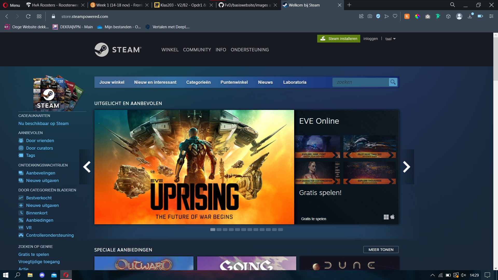
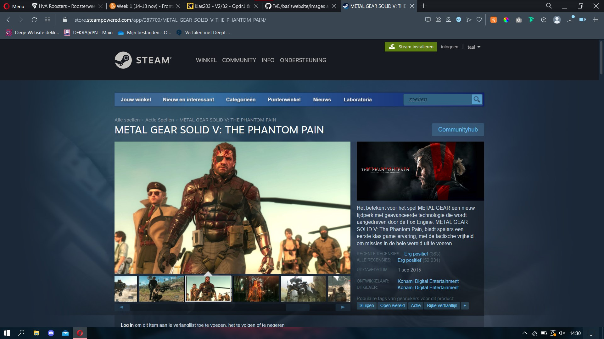
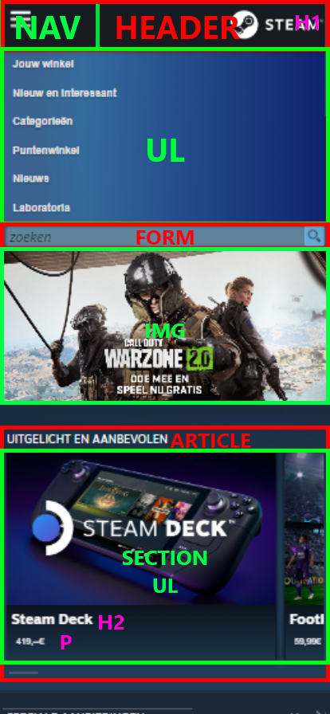
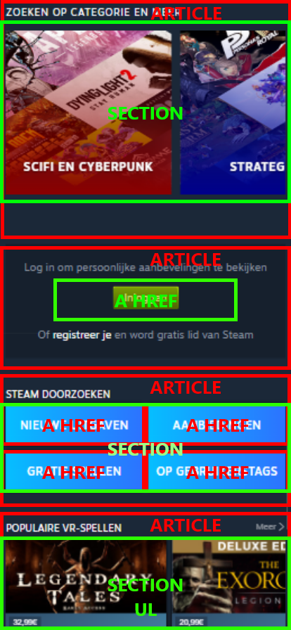
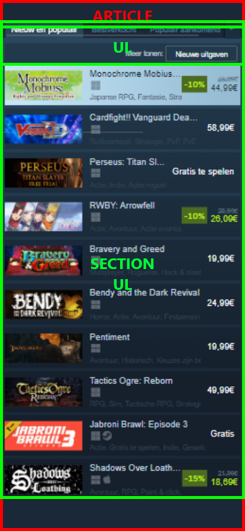
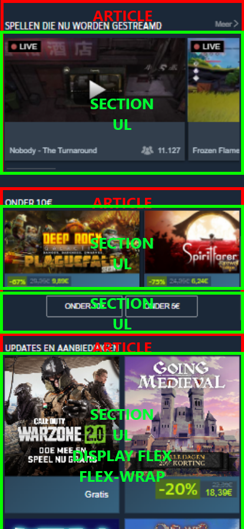
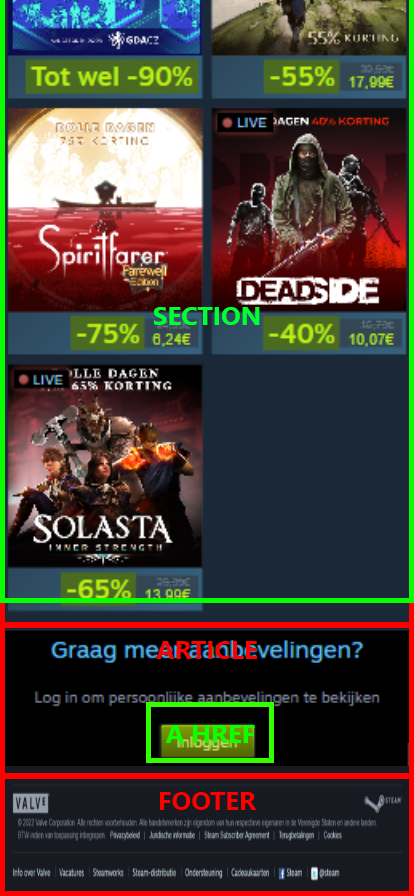
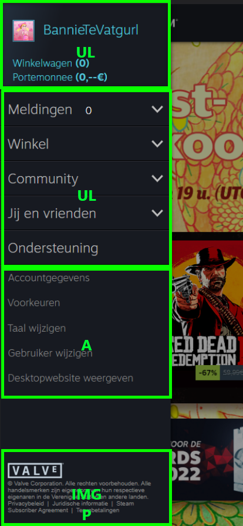

# Procesverslag
Markdown is een simpele manier om HTML te schrijven.  
Markdown cheat cheet: [Hulp bij het schrijven van Markdown](https://github.com/adam-p/markdown-here/wiki/Markdown-Cheatsheet).

Nb. De standaardstructuur en de spartaanse opmaak van de README.md zijn helemaal prima. Het gaat om de inhoud van je procesverslag. Besteedt de tijd voor pracht en praal aan je website.

Nb. Door *open* toe te voegen aan een *details* element kun je deze standaard open zetten. Fijn om dat steeds voor de relevante stuk(ken) te doen.

## Jij

  
uitwerken voor kick-off werkgroep

  ### Auteur:
  Koen Dekker

  #### Je startniveau:
  Rood

  #### Je focus:
  Surface Plane
 

## Je website

  
uitwerken voor kick-off werkgroep

  ### Je opdracht:
  https://store.steampowered.com

  #### Screenshot(s) van de eerste pagina (small screen): 
  Home Pagina  
  

  #### Screenshot(s) van de tweede pagina (small screen):
  Metal Gear Solid V Store Pagina   
  
 

## Toegankelijkheidstest 1/2 (week 1)

  
uitwerken na test in 1e werkgroep

  ### Bevindingen
  Lijst met je bevindingen die in de test naar voren kwamen:

  #### Screenreader
  De screenreader was amper te gebruiken. 9 van de 10 afbeeldingen op de website hadden geen label waardoor je niet kon weten wat de afbeelding was. Zelfs het log van de website zelf had geen label!

  Hoe kan dit opgelost worden?  
  Alle afbeeldingen goede duidelijke labels geven zodat je weet waar je bent en wat de afbeelding is.

  #### Muis en Toetsenbord 
  Via Tab was het op het begin duidelijk waar jij je bevindt. De website gaf duidelijk aan door middel van een lichte lijn om het item heen waar je was, totdat je doorklikt. Je komt dan terecht bij een lijst die niet in beeld staat. Als je daarna verder klikt en je bij de foto's komt wordt er niks meer aangegeven. Je bent dan volledig afhankelijk van de tekst die links onderin staat. 
  
  Hoe kan dit opgelost worden?
  Duidelijk per item aangeven waar je bent. De lijstitems die niet in beeld zijn verstoppen zodat ze niet worden geselecteerd. Alle items kunnen worden gesorteerd per categorie zodat je minder lang alle lijsten af hoeft te gaan van onderdelen wat jou niet interesseert.

  #### Motoriek (shocks, elastiekjes)
  Motoriek is het prima te doen met de website. Echter als je problemen hebt zoals parkinson is er een mogelijkheid dat je snel klikt op het verkeerde onderdeel.

  Hoe kan dit mogelijk opgelost worden?
  Door middel van wat meer ruimte tussen de onderdelen.

  #### Visueel (brillen, contrast, kleurenblind, dark/light). 
  De website is lastig te bekijken door de brillen heen. Het overzicht verlies je snel en het is lastig om je focus te houden op 1 onderwerp als je eventjes wegkijkt.   Dark/light mode is er niet, Steam staat altijd op darkmode. Kleurenblind/contrast is in principe prima te handelen. Het enige nadeel is dat het lichtelijk slecht te   lezen is door het lage contrast.

  Hoe kan dit opgelost worden?
  Door een light mode toe te voegen. Hierdoor is het makkelijker om naar de kleuren van de website te kunnen kijken.

## Breakdownschets (week 1)

  
uitwerken na afloop 2e werkgroep

  ### de hele pagina: 
  
  
  
  
  
  

  ### dynamisch deel (bijv menu): 
  

## Voortgang 1 (week 2)

  
uitwerken voor 1e voortgang

  ### Stand van zaken
  Het maken van de website zelf ging wel goed. Ik denk dat ik vrij goed op weg ben.

  ### Agenda voor meeting
  samen met je groepje opstellen

  | Koen                                           | Soraya                       | 
  | Vraag over categorieën                         | Foto kan niet in het midden. | 
  | en vraag over opdracht: wel betermaken of niet?| Ordered list                 | 

  ### Verslag van meeting
  hier na afloop snel de uitkomsten van de meeting vastleggen

  - Catergoie vraag opgelost. Achteraf toch aangepast.
  - Zeker betermaken! Dat is hartstikke goed!

## Voortgang 2 (week 3)

  
uitwerken voor 2e voortgang

  ### Stand van zaken
  Ik vind dat ik zoals vorigeweek vrij goed bezig ben. Ik pak het javascript en alle codes waar we het vorig jaar over hebben weer vrij snel op. Het is mij ook opgevallen dat ik met een veel kritischer oog kijk naar het werk dat ik maak. Ik kijk voornamelijk in het oog van de gebruiker. Vind ik het logisch als dit zo staat? Of is dit makkelijk te lezen?

  ### Agenda voor meeting
  samen met je groepje opstellen

  | Koen Dekker     | Soraya        | 
  | Moet ik nog meer toevoegen aan mijn huidige pagina?| Heeft een vraag over een cirkel    |   

  ### Verslag van meeting
  hier na afloop snel de uitkomsten van de meeting vastleggen

  - Span verwijderen want waarschijnlijk is P genoeg.
  - Ik hoef niks meer toe te voegen. Het is al goed. Als ik wil kan ik nog wat toevoegen.
- ...

## Toegankelijkheidstest 2/2 (week 4)

  
Ik heb de website over het algemeen goed aangepast zodat de website meer toegangelijk is voor verschillende soorten aandoeningen. Met name op het zichtfactor is het daarin erg opgestoken.

  ### Bevindingen
  Lijst met je bevindingen die in de test naar voren kwamen (geef ook aan wat er verbeterd is):

  #### Screenreader
  De screenreader was wederom amper te gebruiken. Ik ben er nog niet achter of dit ligt aan mijn screenreader zelf of aan mijn website. Ik ga vragen aan een klasgenoot of die het op hun Macbook kan testen.

  Hoe kan dit opgelost worden?
  Als het probleem ligt bij mijn website: namen aanpassen zodat hij alleen de link noemt ipv ook de afbeelding.

  #### Muis en Toetsenbord 
  Met de muis en het toetsenbord (bijvoorbeeld door middel van tab) is de website goed door te navigeren.

  #### Motoriek (shocks, elastiekjes)
  Na het testen met het schockaparaat kwamen we er ook achter dat de website prima te bedienen is. Wel met de tabknop. De muis is slecht te gebruiken.

  Hoe kan dit opgelost worden?
  Door de tabtoets te gebruiken.
  
  #### Visueel (brillen, contrast, kleurenblind, dark/light). 
  We kwamen er achter dat een aantal lettertyp-kleuren te donker waren om goed te kunnen zien.

  Hoe kan dit opgelost worden?
  Ik heb inmiddels de kleuren aangepast zodat het beter leesbaar is. Ook getest met de brillen.

## Voortgang 3 (week 4)

  
uitwerken voor 3e voortgang

  ### Stand van zaken
  Deze week ben ik vooral bezig geweest met mijn website afmaken. Ik heb veel moeite met de goede code vinden die werkt op het item die ik wil aanpassen. Hierdoor ben ik vaak wat langer bezig. Maar als ik het afheb dan werkt het ook goed. Dus over het algemeen gaat het vrij goed.

  ### Agenda voor meeting
  samen met je groepje opstellen

  | Koen    | Soraya           | 
  | ---            | ---                | 
  | Vraag over Fontsizes | Vraag over responsive            | 
  | Vraag of er nog meer dingen bij moeten voor en voldoende | Vraag over grid | 

  ### Verslag van meeting
  hier na afloop snel de uitkomsten van de meeting vastleggen

  - Fontsizes zijn prima! Ik moet ze wel allemaal gelijk maken.
  - Kijk nog even naar het beoordelingsformulier

## Eindgesprek (week 5)

  
uitwerken voor eindgesprek

  ### Je uitkomst - karakteristiek screenshots:
  

  ### Dit ging goed/Heb ik geleerd: 
  Korte omschrijving met plaatjes

  

  ### Dit was lastig/Is niet gelukt:
  Korte omschrijving met plaatjes

  

## Bronnenlijst

  
continu bijhouden terwijl je werkt

  Nb. Wees specifiek ('css-tricks' als bron is bijv. niet specifiek genoeg).

  1. https://css-tricks.com/snippets/css/a-guide-to-flexbox/
  2. https://css-tricks.com/snippets/css/complete-guide-grid/
  3. https://cssgradient.io
  4. De top hulp van de Studentassistenten! Wat een toppers zijn dat!

